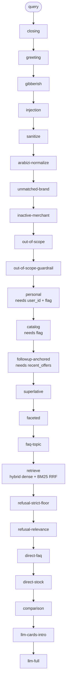
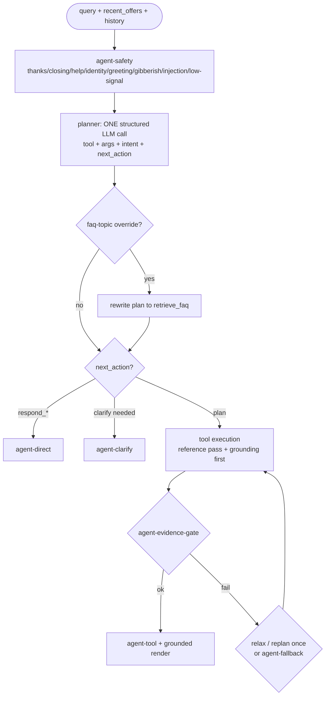
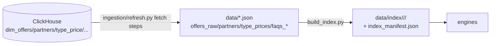

# Waffarha Chatbot — Verified Architecture

> Derived only from repo inspection plus the `audit/verification` trace runs
> (`eval/turn_trace.py` → `eval/acceptance_traces.jsonl`,
> `reports/verification_report.md`). Anything not executed is drawn **dashed**.
> Exit-gate names are the harness glossary (§6).

## 1. System layers

```mermaid
flowchart TB
    W[static/index.html<br/>vanilla JS, API_BASE='']]
    A[core/app.py :8000<br/>cascade RagEngine]
    G[core/agent_server.py :8001<br/>AgentEngine]
    W --> A
    W --> G
    A --> E1[RagEngine singleton<br/>embedder + Qdrant + faceted]
    G --> E2[AgentEngine singleton<br/>facade over SAME RagEngine + ToolRegistry]
    E1 --> V[vectorstores/<br/>FAISS/Chroma/Qdrant/LanceDB/pgvector + BM25]
    E1 --> F[FacetedCatalog<br/>offline in-memory offers]
    E1 -.-> C[(ClickHouse live<br/>catalog + personal)]
    E2 --> F
    E2 -.-> C
    A --> M[memory/ + session/<br/>Redis or local]
    G --> M
    C -.-> I[ingestion/refresh.py<br/>ClickHouse to data/ to index/]
    I --> V
```

`run_servers.py` serves both apps in ONE process so one embedder and one
Qdrant folder handle are shared (`core/app.py` `get_engine` /
`get_agent_engine`; Qdrant embedded mode forbids two openers).

## 2. Cascade route (`RagEngine.answer_stream`) — real order



Notes: the single-offer direct shortcut is DISABLED by design (comment at
`answer_stream` post-stock branch). Refusal branches clear `_last_retrieved`
so no stale cards render. Personal/catalog are live-ClickHouse paths
(dashed below where not executed in this env).

## 3. Agent route (`AgentEngine._run_turn`)



Planner output is never user-facing text. No chain-of-thought is stored;
`AgentState.trace` holds structured decisions only.

## 4. Shared vs separate

| Component | :8000 cascade | :8001 agent | Shared? |
|---|---|---|---|
| HTTP shape (`/api/chat`, `/stream`, `/health`, `/session/...`) | yes | yes | same code/imports |
| RagEngine, embedder, Qdrant handle | yes | via facade | one singleton |
| Session memory, identity, generation semaphore | yes | yes | same singletons |
| Planner, tools, evidence gate | — | yes | agent only |
| Deterministic gates/greetings | cascade list | safety-gate list | separate lists |

## 5. Data / ingestion flow



`--plan` reports lineage without writes; `--skip-fetch` rebuilds from
`data/`; the manifest records model/backend/corpus hash/doc hashes.

## 6. Exit-gate glossary (harness names)

Cascade: `closing`, `greeting`, `gibberish`, `injection`,
`unmatched-brand`, `inactive-merchant`, `out-of-scope`,
`out-of-scope-guardrail`, `personal`, `catalog`, `followup-anchored`,
`superlative`, `faceted`, `faq-topic`, `refusal-strict-floor`,
`refusal-relevance`, `direct-faq`, `direct-stock`, `comparison`,
`llm-cards-intro`, `llm-full`.
Agent: `agent-safety`, `agent-clarify`, `agent-direct:<next_action>`,
`tool:<name>`, `agent-fallback:<reason>`.
